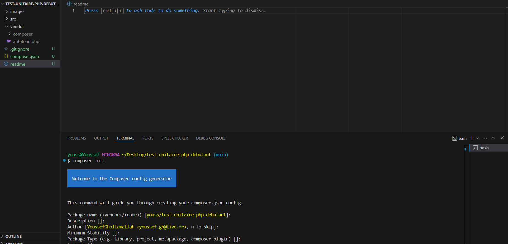
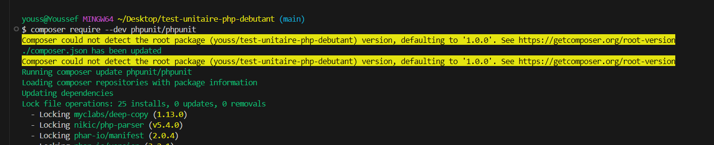
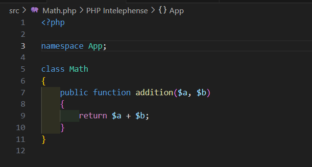
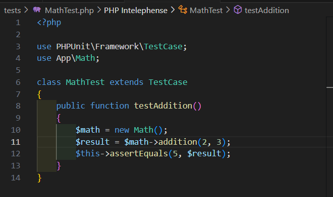
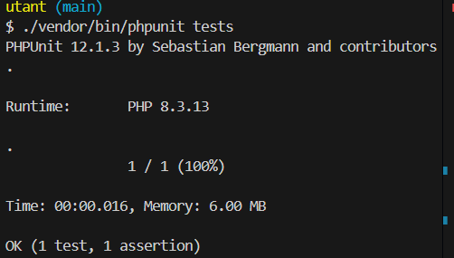

# Tests Unitaire en PHP

Dans ce projet, je vais vous présentez le principe des tests unitaires en PHP avec la librairie PHPUnit

## Pré-requis :

- Avoir une version 7.1+ de PHP, vérifier avec la commande suivante de la version :

```
php -v
```

## Installation:

1. Créer le dossier de votre projet et nommez-le test-unitaire-php-debutant

2. Ouvrez le terminal à la racine de votre projet dans l'IDE de votre choix.

3. Initialisez composer dans votre terminal avec la commande suivante :

- ```
     composer init
    ```
- 

4. Installer la librairie PHPUnit
    - 
    
5. Création de la structure
    - un dossier "src" vide à du être créer avec phpunit. ( sinon le créer)
    - Créer un fichier Math.php dans le dossier "src".
    - Dans le fichier créer une class Math avec une méthode **addition** qui prend 2 paramètre $a et $b qui retourne la somme des deux paramètres.
    - 

6. Mise en place du test unitaire
    - Créer un dossier tests à la racine de votre projet.
    - Dans votre dossier tests, créer un fichier MathTest.php et écrire un test pour vérifier votre méthode d'addition
    - 

7. Lancer votre test unitaires
    - Entrez la commande pour lancez votre test
    - ```bash
         ./vendor/bin/phpunit tests
         ```
    - 

8. Tester les erreurs, pour vérifier votre code:
    - modifie la méthode addition en remplaçant le signe d'addition par celui de multiplication par exemple et relancez et vous aurez une erreur.